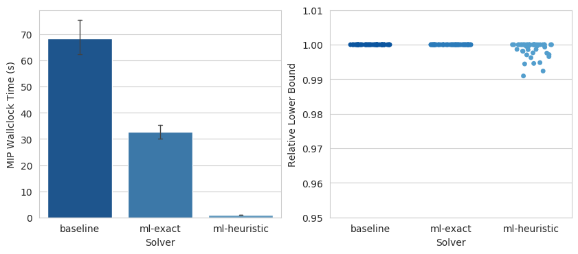

# Benchmark Problems, Challenges and Results

MIPLearn provides a selection of benchmark problems and random instance generators, covering applications from different fields, that can be used to evaluate new learning-enhanced MIP techniques in a measurable and reproducible way. In this page, we describe these problems, the included instance generators, and we present some benchmark results for  `LearningSolver` with default parameters.

## Preliminaries

### Benchmark challenges

When evaluating the performance of a conventional MIP solver, *benchmark sets*, such as MIPLIB and TSPLIB, are typically used. The performance of newly proposed solvers or solution techniques are typically measured as the average (or total) running time the solver takes to solve the entire benchmark set. For Learning-Enhanced MIP solvers, it is also necessary to specify what instances should the solver be trained on (the *training instances*) before solving the actual set of instances we are interested in (the *test instances*). If the training instances are very similar to the test instances, we would expect a Learning-Enhanced Solver to present stronger perfomance benefits.

In MIPLearn, each optimization problem comes with a set of **benchmark challenges**, which specify how should the training and test instances be generated. The first challenges are typically easier, in the sense that training and test instances are very similar. Later challenges gradually make the sets more distinct, and therefore harder to learn from.

### Baseline results

To illustrate the performance of `LearningSolver`, and to set a baseline for newly proposed techniques, we present in this page, for each benchmark challenge, a small set of computational results measuring the solution speed of the solver and the solution quality with default parameters. For more detailed computational studies, see [references](about.md#references). We compare three solvers:

* **baseline:** Gurobi 9.0 with default settings (a conventional state-of-the-art MIP solver)
* **ml-exact:** `LearningSolver` with default settings, using Gurobi 9.0 as internal MIP solver
* **ml-heuristic:** Same as above, but with `mode="heuristic"`

All experiments presented here were performed on a Linux server (Ubuntu Linux 18.04 LTS) with Intel Xeon Gold 6230s (2 processors, 40 cores, 80 threads) and 256 GB RAM (DDR4, 2933 MHz). All solvers were restricted to use 4 threads, with no time limits, and 10 instances were solved simultaneously at a time.

## Maximum Weight Stable Set Problem

### Problem definition

Given a simple undirected graph $G=(V,E)$ and weights $w \in \mathbb{R}^V$, the problem is to find a stable set $S \subseteq V$ that maximizes $ \sum_{v \in V} w_v$. We recall that a subset $S \subseteq V$ is a *stable set* if no two vertices of $S$ are adjacent. This is one of Karp's 21 NP-complete problems.

### Random instance generator

The class `MaxWeightStableSetGenerator` can be used to generate random instances of this problem, with user-specified probability distributions. When the constructor parameter `fix_graph=True` is provided, one random Erdős-Rényi graph $G_{n,p}$ is generated during the constructor, where $n$ and $p$ are sampled from user-provided probability distributions `n` and `p`. To generate each instance, the generator independently samples each $w_v$ from the user-provided probability distribution `w`. When `fix_graph=False`, a new random graph is generated for each instance, while the remaining parameters are sampled in the same way.

### Benchmark challenges

#### Challenge A

* Fixed random Erdős-Rényi graph $G_{n,p}$ with $n=200$ and $p=5\%$
* Random vertex weights $w_v \sim U(100, 150)$
* 300 training instances, 50 test instances

```python
MaxWeightStableSetGenerator(w=uniform(loc=100., scale=50.),
                            n=randint(low=200, high=201),
                            p=uniform(loc=0.05, scale=0.0),
                            fix_graph=True)
```

### Benchmark results

#### Challenge A



## Multidimensional 0-1 Knapsack Problem

### Problem definition

Given a set of $n$ items and $m$ types of resources (also called *knapsacks*), the problem is to find a subset of items that maximizes profit without consuming more resources than it is available. More precisely, the problem is:

\begin{align*}
    \text{maximize}
        & \sum_{j=1}^n p_j x_j
        \\
    \text{subject to}
        & \sum_{j=1}^n w_{ij} x_j \leq b_i
        & \forall i=1,\ldots,m \\
    & x_j \in \{0,1\}
        & \forall j=1,\ldots,n
\end{align*}

### Random instance generator

The class `MultiKnapsackGenerator` can be used to generate random instances of this problem. The number of items $n$ and knapsacks $m$ are sampled from the user-provided probability distributions `n` and `m`. The weights $w_{ij}$ are sampled independently from the provided distribution `w`. The capacity of knapsack $i$ is set to

$$
    \alpha_i \sum_{j=1}^n w_{ij}
$$

where $\alpha_i$, the tightness ratio, is sampled from the provided probability
distribution `alpha`. To make the instances more challenging, the costs of the items
are linearly correlated to their average weights. More specifically, the weight of each
item $j$ is set to:

$$
    \sum_{i=1}^m \frac{w_{ij}}{m} + K  u_j,
$$

where $K$, the correlation coefficient, and $u_j$, the correlation multiplier, are sampled
from the provided probability distributions `K` and `u`. Note that $K$ is only sample once for the entire instance.

This random generation procedure was developed by A. Freville and G. Plateau (*An efficient preprocessing procedure for the multidimensional knapsack problem*, Discrete Applied Mathematics 49 (1994) 189–212).